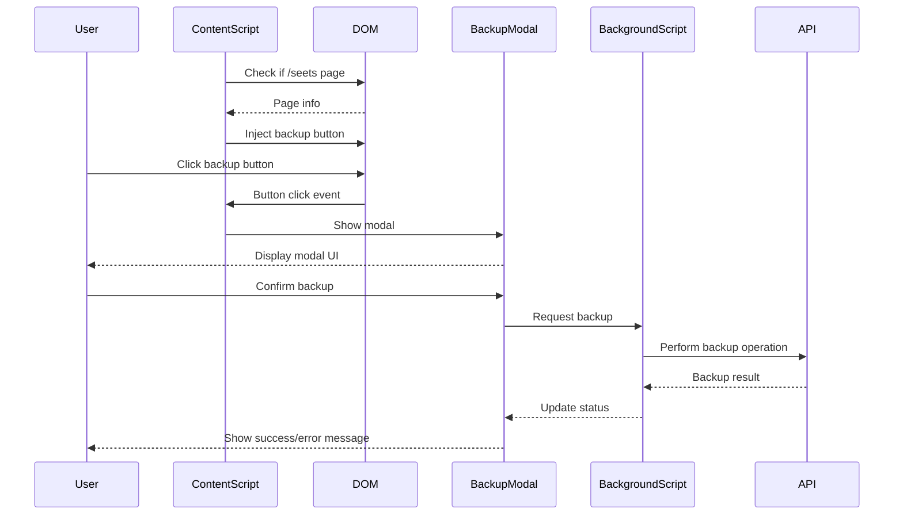

# Design Document: DB Backup Button for Seets

## Overview

This design document outlines the approach for extending the existing DB backup functionality from the /workspaces pages to the /seets directory pages. The implementation will reuse the existing modal component to maintain consistency and reduce code duplication.

## Architecture

The current architecture of the application includes:

1. Content scripts that inject UI elements and functionality into GitHub pages
2. Background scripts that handle API calls and storage operations
3. Utility functions for specific features

For this feature, we will:

1. Identify the existing code that implements the DB backup button in /workspaces pages
2. Create a mechanism to detect when a user is on a /seets page
3. Inject the same DB backup button UI element into /seets pages
4. Connect the button to the existing modal and backup functionality

## Components and Interfaces

### Page Detection Component

We need to extend the current page detection logic to identify when a user is on a page under the /seets directory.

```typescript
// Conceptual interface
interface PageDetector {
  isWorkspacesPage(): boolean;
  isSeetsPage(): boolean;  // New method
}
```

### Button Injection Component

The existing button injection logic needs to be modified to work with both /workspaces and /seets pages.

```typescript
// Conceptual interface
interface ButtonInjector {
  injectBackupButton(targetElement: HTMLElement): void;
}
```

### Modal Component

The existing modal component will be reused without modification:

```typescript
// Conceptual interface
interface BackupModal {
  show(): void;
  hide(): void;
  performBackup(): Promise<void>;
}
```

## Data Models

No new data models are required for this feature. The existing data structures used for DB backups will be reused.

## Implementation Details

### Page Detection

We will extend the current page detection logic to identify /seets pages:

```typescript
function isSeetsPage(): boolean {
  return window.location.pathname.includes('/seets');
}
```

### Button Injection

We will modify the button injection logic to work with both page types:

```typescript
function injectBackupButtonIfNeeded(): void {
  if (isWorkspacesPage() || isSeetsPage()) {
    const targetElement = findTargetElement();
    if (targetElement) {
      injectBackupButton(targetElement);
    }
  }
}
```

### Target Element Selection

We need to identify the appropriate DOM element in the /seets pages where the backup button should be injected:

```typescript
function findTargetElement(): HTMLElement | null {
  if (isWorkspacesPage()) {
    return document.querySelector('.workspaces-header-actions');
  } else if (isSeetsPage()) {
    return document.querySelector('.seets-header-actions');
  }
  return null;
}
```

### Event Handling

The event handling for the button click will remain the same, reusing the existing modal:

```typescript
function handleBackupButtonClick(event: MouseEvent): void {
  event.preventDefault();
  showBackupModal();
}
```

## Error Handling

The existing error handling for the DB backup functionality will be reused. This includes:

1. Handling API errors during the backup process
2. Displaying appropriate error messages in the modal
3. Providing retry functionality if a backup fails

## Testing Strategy

### Unit Tests

1. Test the `isSeetsPage()` function with various URL patterns
2. Test the `findTargetElement()` function with mocked DOM structures
3. Test the button injection logic with mocked DOM elements

### Integration Tests

1. Test the end-to-end flow of injecting the button on /seets pages
2. Test the interaction between the button and the modal
3. Test the backup functionality when initiated from /seets pages

### Manual Testing

1. Verify the button appears correctly on various /seets pages
2. Verify the modal opens and functions correctly
3. Verify the backup process works end-to-end
4. Verify the UI is consistent with the /workspaces implementation

## Diagrams

### Component Interaction Flow



### UI Component Placement

```mermaid
graph TD
    A[GitHub Page] --> B[/workspaces Page]
    A --> C[/seets Page]
    B --> D[Header Actions]
    C --> E[Header Actions]
    D --> F[DB Backup Button]
    E --> G[DB Backup Button]
    F --> H[Backup Modal]
    G --> H
```
